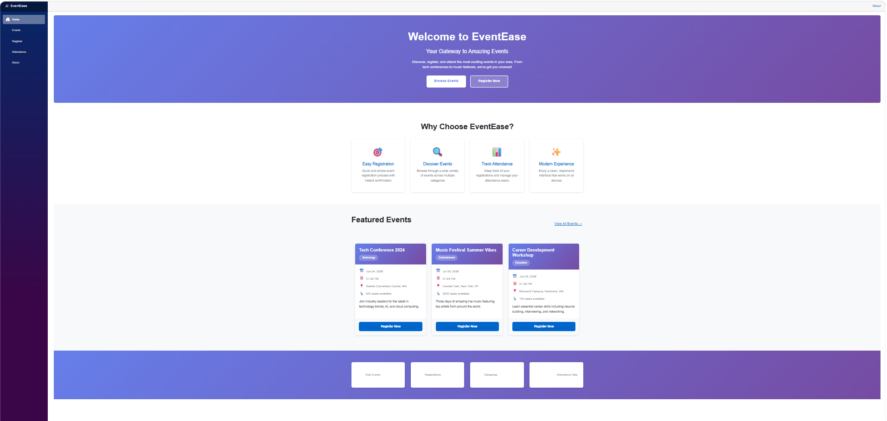
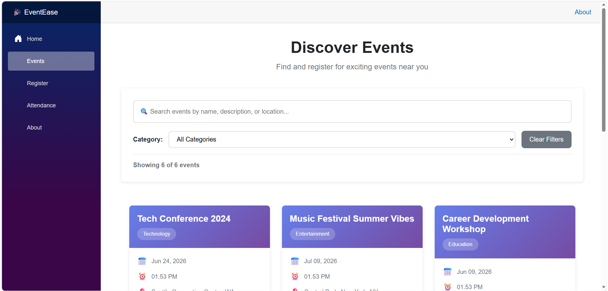
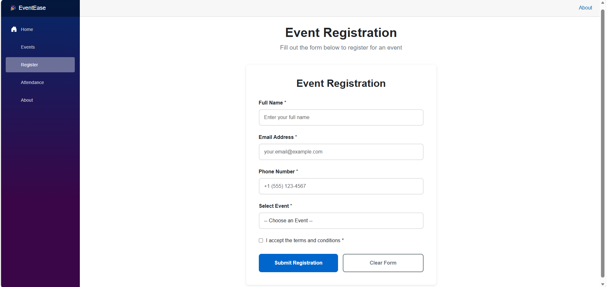
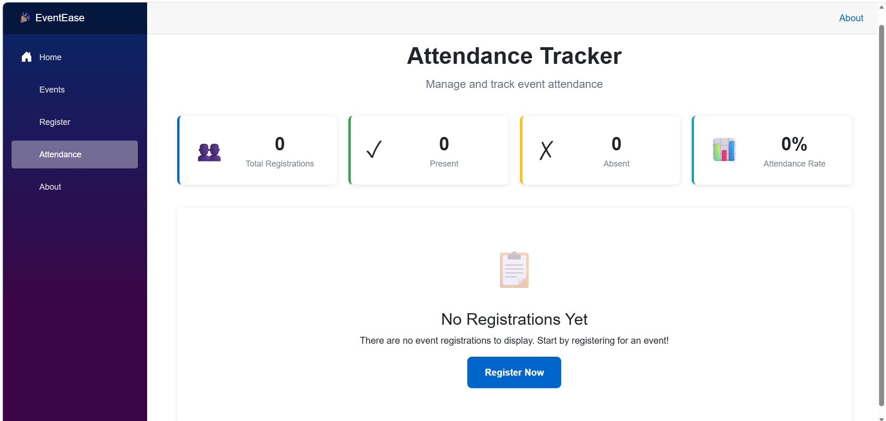

# EventEase - Modern Event Management System


## 📋 Project Overview

**EventEase** is a modern, full-featured Event Management System built with **ASP.NET Core Blazor Web App** using **.NET 8** and **C#**. This application demonstrates best practices in web development, including component-based architecture, state management, form validation, and responsive design.

This project was created as a peer-graded assignment for the Microsoft/Coursera ASP.NET Core and Blazor course, showcasing proficiency in modern web development technologies.

---

## ✨ Key Features

### 🏠 **Home Page**
- Attractive landing page with hero section
- Featured events showcase
- Real-time statistics dashboard
- Responsive navigation menu

### 🎯 **Event Browsing**
- Browse all available events
- Search events by name, description, or location
- Filter events by category
- Responsive card-based layout

### 📝 **Event Registration**
- Comprehensive registration form
- Client-side validation using Data Annotations
- Required field validation
- Email and phone number validation
- Terms and conditions checkbox
- Success confirmation message

### 📊 **Attendance Tracking**
- View all registered attendees
- Mark attendance (Present/Absent)
- Filter by attendance status
- Real-time statistics dashboard
- Attendance rate calculation

### 🔄 **State Management**
- Centralized application state using `AppState` service
- Real-time updates across components
- Event-driven architecture

### ⚡ **Performance Optimized**
- Efficient component rendering
- Lazy loading concepts
- Optimized event handling
- Minimal re-rendering

---

## 🛠️ Technologies Used

| Technology | Description |
|------------|-------------|
| **ASP.NET Core** | Blazor Web App framework for building interactive web UIs |
| **.NET 8** | Latest .NET platform with modern C# features |
| **C# 12** | Modern C# language with latest features |
| **Razor Components** | Reusable UI components with parameters and data binding |
| **CSS3** | Modern styling with responsive design |
| **Dependency Injection** | Service-based architecture for state management |
| **Data Annotations** | Comprehensive form validation |

---

## 📁 Project Structure

```
EventEase/
│
├── Components/
│   ├── EventCard.razor              # Reusable event card component
│   ├── RegistrationForm.razor       # Registration form with validation
│   │
│   ├── Pages/
│   │   ├── Home.razor               # Landing page with featured events
│   │   ├── Events.razor             # Event browsing with search/filter
│   │   ├── Register.razor           # Registration page
│   │   ├── Attendance.razor         # Attendance tracking dashboard
│   │   └── About.razor              # About page
│   │
│   └── Layout/
│       ├── MainLayout.razor         # Main application layout
│       └── NavMenu.razor            # Navigation menu
│
├── Models/
│   ├── Event.cs                     # Event data model
│   └── Registration.cs              # Registration data model
│
├── Services/
│   └── AppState.cs                  # Application state management service
│
├── wwwroot/
│   └── css/
│       └── app.css                  # Custom application styles
│
├── Program.cs                       # Application configuration & DI setup
├── EventEase.csproj                 # Project file
└── README.md                        # This file
```

---

## 🚀 How to Run the Project

### Prerequisites

- [.NET 8 SDK](https://dotnet.microsoft.com/download/dotnet/8.0) installed
- Visual Studio 2022 (v17.8 or later) or Visual Studio Code
- A modern web browser (Chrome, Edge, Firefox, Safari)

### Running the Application

1. **Clone the repository**
   ```bash
   git clone <your-repository-url>
   cd EventEase
   ```

2. **Restore dependencies**
   ```bash
   dotnet restore
   ```

3. **Build the project**
   ```bash
   dotnet build
   ```

4. **Run the application**
   ```bash
   dotnet run
   ```

5. **Open your browser**
   - Navigate to: `https://localhost:5001` or `http://localhost:5000`
   - The application will automatically open in your default browser

### Running in Visual Studio

1. Open `EventEase.csproj` in Visual Studio 2022
2. Press `F5` or click the **Run** button
3. The application will launch in your default browser

---

## 🎨 Features Demonstration

### Component-Based Architecture

**EventCard.razor** - Reusable component with:
- Component parameters (`[Parameter]`)
- Two-way data binding (`@bind`)
- Event callbacks (`EventCallback<T>`)
- Proper styling and responsive design

```csharp
<EventCard EventData="@eventItem" 
          ShowRegisterButton="true"
          OnRegisterClicked="HandleRegister"
          @bind-IsSelected="@selectedEventIds[eventItem.Id]" />
```

### Form Validation

**RegistrationForm.razor** implements:
- `EditForm` component
- `DataAnnotationsValidator`
- `ValidationSummary`
- Input components (`InputText`, `InputSelect`, `InputCheckbox`)
- Custom validation messages

### State Management

**AppState.cs** service provides:
- Centralized data storage
- Event notifications (`OnChange` event)
- CRUD operations for events and registrations
- Attendance tracking logic
- Statistics calculation

### Routing

Application uses Blazor routing with the following routes:
- `/` - Home page
- `/events` - Event browsing
- `/register` - Registration form
- `/attendance` - Attendance tracker
- `/about` - About page

---

## 📸 Screenshots

*Add your screenshots here after running the application*

### Home Page


### Events Page


### Registration Form


### Attendance Tracker


---

## 🤖 How Microsoft Copilot Assisted

Microsoft Copilot played a crucial role in the development of EventEase, providing intelligent assistance throughout the project:

### 1. **Component Generation**
Copilot helped generate the `EventCard` component with:
- Proper parameter definitions
- Two-way data binding implementation
- Event callback handlers
- Responsive CSS styling with hover effects

### 2. **Routing Debugging**
Assisted in troubleshooting and implementing:
- Proper Blazor routing configuration
- NavLink navigation with active state
- Route parameter handling
- Error page routing

### 3. **Form Optimization**
Helped optimize the `RegistrationForm` with:
- EditForm configuration
- DataAnnotationsValidator setup
- ValidationSummary implementation
- Custom validation messages
- Form submission handling

### 4. **Validation Logic**
Copilot assisted in implementing comprehensive validation:
- Required field validators
- EmailAddress attribute
- Phone number validation with regex
- Custom Range validators
- Terms acceptance validation

### 5. **Attendance Tracker Implementation**
Helped implement the attendance tracking system:
- Real-time updates using event notifications
- Filtering functionality (All/Present/Absent)
- Statistics dashboard calculation
- Toggle attendance functionality
- Responsive table design

### 6. **State Management Design**
Assisted in designing and implementing:
- AppState service architecture
- Event-driven state updates
- Dependency injection configuration
- Component communication patterns

### 7. **CSS Styling**
Copilot helped create modern, responsive CSS:
- CSS custom properties for theming
- Flexbox and Grid layouts
- Hover and transition effects
- Mobile-responsive media queries
- Animation keyframes

### 8. **Best Practices**
Provided guidance on:
- Component lifecycle methods
- Efficient rendering patterns
- Proper disposal of event handlers
- Memory management
- Performance optimization techniques

---

## 📚 Learning Outcomes

This project demonstrates proficiency in:

✅ Building modern web applications with Blazor  
✅ Component-based architecture and reusability  
✅ State management patterns  
✅ Form handling and validation  
✅ Routing and navigation  
✅ Responsive web design  
✅ Dependency injection  
✅ Event-driven programming  
✅ Data binding (one-way and two-way)  
✅ CSS styling and animations  

---

## 🔧 Architecture Highlights

### Component-Based Design
- Reusable `EventCard` and `RegistrationForm` components
- Parameter passing for component configuration
- Event callbacks for parent-child communication

### Model Layer
- Clean separation with `Event` and `Registration` models
- Data Annotations for validation rules
- Type-safe data structures

### Service Layer
- `AppState` service for centralized state management
- Scoped service lifetime for per-user state
- Event notifications for real-time updates

### Two-Way Data Binding
- Efficient data synchronization between components
- `@bind` directive usage
- Custom two-way binding with `@bind-IsSelected`

### Routing System
- Client-side routing with `@page` directive
- NavLink for active route highlighting
- Route parameters support

### Form Processing
- EditForm with model binding
- Client-side validation
- Success/error handling
- Form state management

---

## 📤 GitHub Setup Instructions

### Creating a New Repository

1. **Go to GitHub** and sign in to your account
2. Click the **"+"** icon in the top right corner
3. Select **"New repository"**
4. Enter repository name: `EventEase`
5. Add description: `Modern Event Management System built with ASP.NET Core Blazor`
6. Choose **Public** or **Private**
7. Click **"Create repository"**

### Pushing Your Project to GitHub

```bash
# Navigate to your project directory
cd EventEase

# Initialize Git repository
git init

# Add all files to staging
git add .

# Commit your changes
git commit -m "Initial commit: EventEase - Complete Event Management System"

# Rename branch to main (if needed)
git branch -M main

# Add remote origin (replace <your-username> with your GitHub username)
git remote add origin https://github.com/<your-username>/EventEase.git

# Push to GitHub
git push -u origin main
```

### Subsequent Updates

```bash
# Stage your changes
git add .

# Commit with a descriptive message
git commit -m "Update: Description of your changes"

# Push to GitHub
git push
```

### Creating a .gitignore File

Create a `.gitignore` file in your project root to exclude unnecessary files:

```gitignore
## Ignore Visual Studio temporary files, build results, and
## files generated by popular Visual Studio add-ons.

# User-specific files
*.suo
*.user
*.userosscache
*.sln.docstates

# Build results
[Dd]ebug/
[Rr]elease/
x64/
x86/
[Bb]in/
[Oo]bj/

# Visual Studio cache/options
.vs/

# .NET Core
project.lock.json
project.fragment.lock.json
artifacts/

# Files built by Visual Studio
*_i.c
*_p.c
*.ilk
*.obj
*.pch
*.pdb
*.pgc
*.pgd
*.rsp
*.sbr
*.tlb
*.tli
*.tlh
*.tmp
*.tmp_proj
*.log
*.vspscc
*.vssscc
.builds
*.pidb
*.svclog
*.scc
```

---

## 🤝 Contributing

Contributions are welcome! Please feel free to submit a Pull Request.

1. Fork the repository
2. Create your feature branch (`git checkout -b feature/AmazingFeature`)
3. Commit your changes (`git commit -m 'Add some AmazingFeature'`)
4. Push to the branch (`git push origin feature/AmazingFeature`)
5. Open a Pull Request

---

## 📄 License

This project is licensed under the MIT License - see the LICENSE file for details.

---

## 👨‍💻 Author

**Nanditha P**
- GitHub: [@nanditha-satheesh](https://github.com/nanditha-satheesh)
- Email: nandithasatheesh25@gmail.com

---

## 🙏 Acknowledgments

- Microsoft for the excellent ASP.NET Core and Blazor documentation
- Coursera for the learning platform and course structure
- Microsoft Copilot for AI-powered development assistance
- The .NET community for continuous support and resources

---

## 📞 Contact & Support

If you have any questions or need help with the project, please:
- Open an issue in the GitHub repository
- Contact me via email: nandithasatheesh25@gmail.com

---

*Last Updated: May 2026*
